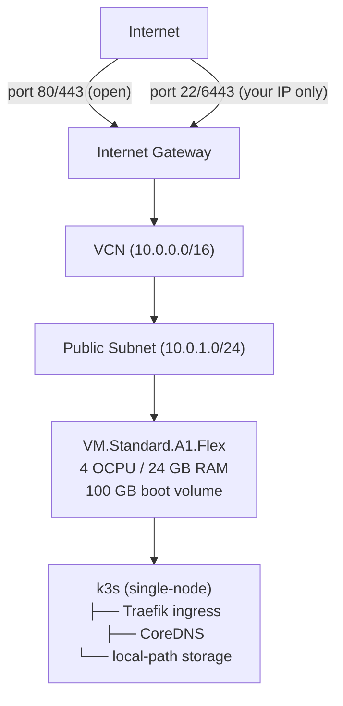

# k3s on Oracle Cloud — Always Free

Single-node [k3s](https://k3s.io) Kubernetes cluster on [Oracle Cloud Infrastructure](https://www.oracle.com/cloud/) using only **[Always Free](https://docs.oracle.com/en-us/iaas/Content/FreeTier/freetier_topic-Always_Free_Resources.htm)** resources. No credit card charges.

## What gets created

| Resource | Spec | Cost |
|---|---|---|
| VM.Standard.A1.Flex (ARM) | 4 OCPU / 24 GB RAM | Free |
| Boot volume | 100 GB | Free |
| VCN + subnet + internet gateway | — | Free |
| OCI Budget alert | 1 alert at $0.01 | Free |

Oracle's Always Free tier includes 4 ARM OCPUs and 24 GB RAM total — this config uses all of it for a single beefy node.

## Prerequisites

- Oracle Cloud account ([sign up](https://www.oracle.com/cloud/free/)) — use a [home region](https://docs.oracle.com/en-us/iaas/Content/Identity/regions/managingregions.htm) with A1.Flex availability
- [Terraform](https://developer.hashicorp.com/terraform/install) >= 1.6 (see `.tool-versions`)
- SSH key pair

## Setup

### 1. OCI API key

In OCI Console → Profile (top right) → **API Keys** → Add API Key. Download the private key and note the fingerprint. ([docs](https://docs.oracle.com/en-us/iaas/Content/API/Concepts/apisigningkey.htm))

### 2. SSH key

```bash
# Check if you already have one
cat ~/.ssh/id_ed25519.pub

# Generate if needed
ssh-keygen -t ed25519 -C "oracle-k3s"
```

### 3. Variables

```bash
cp terraform.tfvars.example terraform.tfvars
```

Edit `terraform.tfvars`:

```hcl
tenancy_ocid     = "ocid1.tenancy.oc1..aaaa..."
user_ocid        = "ocid1.user.oc1..aaaa..."
fingerprint      = "xx:xx:xx:xx:..."
private_key_path = "~/.oci/oci_api_key.pem"
region           = "us-ashburn-1"

compartment_ocid     = "ocid1.tenancy.oc1..aaaa..."  # root compartment = tenancy OCID
ssh_public_key       = "ssh-rsa AAAAB3..."
ssh_private_key_path = "~/.ssh/id_ed25519"
alert_email          = "you@example.com"

# Your IP — run: curl -s ifconfig.me
allowed_cidr = "1.2.3.4/32"
```

### 4. Find your region

OCI region identifiers: `us-ashburn-1`, `us-phoenix-1`, `eu-frankfurt-1`, `ap-sydney-1`, `ap-tokyo-1`, etc. This must be your **home region** — Always Free resources are only available there. See the [full region list](https://docs.oracle.com/en-us/iaas/Content/General/Concepts/regions.htm).

## Deploy

```bash
terraform init
terraform plan
terraform apply
```

### Out of host capacity?

A1.Flex instances on the free tier are in high demand. If you see `500-InternalError, Out of host capacity`, use the retry script — it cycles through all three availability domains automatically:

```bash
# Try all ADs once
bash scripts/apply-with-retry.sh

# Retry every 10 minutes until a slot opens (run overnight if needed)
RETRY_INTERVAL=600 MAX_CYCLES=0 bash scripts/apply-with-retry.sh
```

> Off-peak UTC hours (02:00–06:00) typically have more capacity. If all attempts fail across multiple days, creating a new OCI account with `ap-osaka-1` or `ca-toronto-1` as the home region usually has more availability.

After `apply` completes (~5–10 minutes for cloud-init + k3s to start), Terraform will:
1. SSH into the node and wait for k3s to report `Ready`
2. Download the kubeconfig to `./kubeconfig` with the public IP patched in

## Access the cluster

```bash
export KUBECONFIG=$(pwd)/kubeconfig
kubectl get nodes
```

Or use the Makefile:

```bash
make output        # show all outputs including public IP
make public-ip     # just the IP
```

## Terraform state

State is stored locally in `terraform.tfstate` (gitignored). Back it up or see `bootstrap/state/` for options.

> **Note:** OCI Object Storage S3-compatible API is incompatible with Terraform 1.8+ due to [AWS SDK v2 chunked encoding](https://github.com/hashicorp/terraform/issues/34879). Alternatives that work: [Terraform Cloud](https://app.terraform.io) (free tier) or [Cloudflare R2](https://developers.cloudflare.com/r2/) (free 10 GB). See `bootstrap/state/README.md` for details.

## Staying free

Three layers protect against accidental charges. See [OCI Always Free limits](https://docs.oracle.com/en-us/iaas/Content/FreeTier/freetier_topic-Always_Free_Resources.htm) and [OCI pricing](https://www.oracle.com/cloud/price-list.html) for reference.

**1. OCI Budget alert** — sends email to `alert_email` if spend exceeds $0.01/month. Uses an existing budget if one is present (OCI allows 1 per compartment on free tier), otherwise creates one.

**2. Lifecycle postconditions** — `terraform apply` hard-fails if the instance shape, OCPU count, memory, or boot volume drift outside Always Free limits.

**3. Audit script** — verify any time:

```bash
bash scripts/check-free-tier.sh <compartment_ocid>
```

Always Free limits this config stays within:

| Resource | Used | Limit |
|---|---|---|
| A1.Flex OCPUs | 4 | 4 |
| A1.Flex RAM | 24 GB | 24 GB |
| Boot volume | 100 GB | 200 GB total |

## Destroy

```bash
terraform destroy
```

## Running tests

No real OCI credentials needed — uses mocked providers.

```bash
terraform test
```

## Architecture



Security list rules:
- Port 22, 6443 → your IP only (`allowed_cidr`)
- Port 80, 443 → open (for workloads)
- All egress → open

## Notes

- **firewalld is disabled** on the instance — OCI security lists handle ingress filtering
- kubeconfig is saved to `./kubeconfig` and excluded from git
- The `null_resource` that fetches kubeconfig re-runs if the instance is replaced
- To add worker nodes: create additional A1.Flex instances and join with the k3s token at `/var/lib/rancher/k3s/server/node-token`
